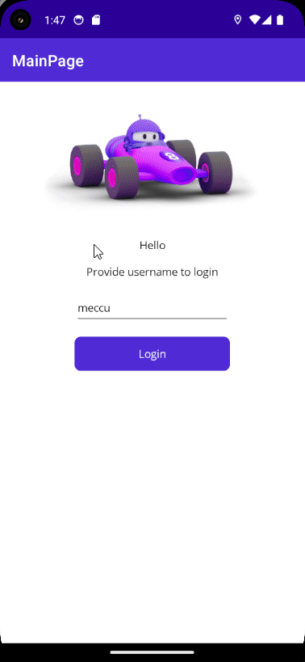

# LesMaui

Cross-platform app with net maui.

## Setup Guide

Check for [Android emulator with hardware acceleration](https://docs.microsoft.com/xamarin/android/get-started/installation/android-emulator?WT.mc_id=friends-mauiworkshop-jamont).

## Memo App

Basic memo storing app using

* MSSQL 2022/ SQL Server for backend
* .NET Core for API 
* .NET MAUI for cross-platform code sharing

### Demo

** API_KEY Invalidated
